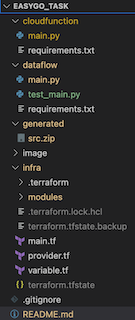

# File Structure

<p>
- cloudfunction folder stores all the python code for cloud function <br>
- dataflow folder stores all the python code for Dataflow <br>
- generated folder saves the zip file compressed from cloud function code <br>
- image folder saves all the picture used by readme file<br>
- infra folder saves all the terraform codes<br>
</p>
<p><br></p>
<p><br></p>
<p><br></p>


# Data Architecture Deisgn


This project sets up a data pipeline on Google Cloud Platform to ingest weather data from OpenWeatherMap API, process it, and store it following the medallion architecture.

The pipeline runs automatically:
1. The Cloud Function is triggered daily by Cloud Scheduler to ingest new data
2. Cloud Function will call the Weather API to get the raw weather data (json file) and save the json file to cloud storage
3. The Dataflow job is triggered by cloud function after the json file saved in cloud storage bucket
4. Dataflow template should be built before triggering the dataflow job. Dataflow template is used to create the dataflow job 
5. The Dataflow job will extract the raw data from cloud storage bucket (bronze layer) and do data transformation then load the data into Bigquery silver dataset (silver layer)  first then Bigquery Gold dataset (Gold layer) second
6. Once the data is ready in Bigquery, user or BA can login to the GCP console and run SQL query to do some data consumption and analysis


<p><br></p>

# Data Schema 


Data Layers:
- Bronze: Raw JSON data in Cloud Storage
- Silver: Deduplicated, Processed, detailed data in BigQuery Silver dataset
- Gold: Aggregated data (daily averages) in BigQuery Gold dataset

In Bronze layer, it is the raw json file which is get from the Weather API. the json format is as the above diagram showed.

Sliver layer is in Bigquery datawarehouse and sliver dataset. there is one table in this layer:weatherData. column names are listed in the above diagram.

Gold layer is in Bigquery datawarehouse and gold dataset. there are three tables in this layer: one fact table and two dimension tables. weatherFact table is fact table. CityDim and DateDim are dimension tables. column names for those tables are listed in the above diagram.

All the BQ datasets and tables are created by terraform. The initialization for schemas see this terraform file. [here](infra/modules/bigquery/main.tf)
<p><br></p>

# Instructions for Setup
### Infrastructure
Go to the infra folder, run the following terraform commands locally to setup all the infrastructures and deploy the cloud function. Make sure the terraform installed in your local environment.
```
$ cd infra
$ gcloud auth application-default login
$ terraform init
$ terraform plan
$ terrraform apply --auto-approve
```

### Dataflow template 
Run the following command under the dataflow folder to build the dataflow template which will be triggered by cloud function.
```
cd ../dataflow

python -m main \
--runner DataflowRunner \
--project easygo-task-428510 \
--staging_location gs://easygo-df-bucket/staging \
--temp_location=gs://easygo-df-bucket/temp \
--template_location gs://easygo-df-bucket/templates/weather-etl-job \
--region australia-southeast1

```
Once all the components are deployed by terraform and dataflow template is created.  
Go to the cloud scheduler console and choose the scheduler just built and click the `force run` button on the right side to run the entire pipeline.

> Notes that  updating the lat and lon environment variables in cloud function  to get the weather data for different city. by default it is melbourne.


### Local Test
If you want to test the dataflow job locally when doing the development. See the following two parts.
#### Run the dataflow job locally
```
cd dataflow
gcloud auth application-default login
pip install -r requirements.txt
python main.py \
  --project=easygo-task-428510 \
  --region=australia-southeast1 \
  --runner=DataflowRunner \
  --temp_location=gs://easygo-df-bucket/temp \
  --staging_location=gs://easygo-df-bucket/staging \
  --job_name=weather-etl-job \
  --experiments=enable_data_sampling
```
#### Run unittest for dataflow locally 
```
cd dataflow
python -m unittest test_main.py    
```

#### Test cloud function
* update the code under the `cloudfunction` folder.
* run `terraform apply` to redeploy the cloud function.
* Go to cloud function console and click the testing tab
* Click the `testing the function` button

<p><br></p>

# Design Choices
### API Selection and Data Ingestion
The following is the reason to choose weather API:
* OpenWeatherMap API offers a well-documented and accessible API that provides a wealth of weather-related data. The API is straightforward to use and has a free tier, making it an ideal choice for development purposes.
* Weather data encompasses a range of variables, including temperature, humidity, wind speed, and atmospheric pressure. This diversity allows for the demonstration of comprehensive data processing and transformation techniques.
* Weather data is updated frequently and can be accessed in near real-time. This characteristic is ideal for illustrating how to set up regular batch processing pipelines.

The reason to use json file to store the raw data is :
* JSON is a human-readable format that is easy to understand and debug. This makes it ideal for development and testing, as the structure of the data can be easily inspected and modified if needed.
* JSON is widely supported across various programming languages and tools, making it a versatile choice for data interchange.
* Cloud Storage and BigQuery, provide robust support for JSON
* CSV is another option but  CSV is not well-suited for nested or hierarchical data structures. Weather data often contains nested elements, which can be cumbersome to represent in CSV. 
* Avro and Parquet files are not human-readable and require specific tools for inspection and debugging. 

### Data Architecture Design
#### Scalability
Auto-Scaling Components: The architecture leverages services that automatically scale based on demand. Cloud Functions, Dataflow, and BigQuery can handle varying loads without manual intervention, ensuring that the system can grow with the increasing volume of weather data and the frequency of data requests.
#### Reliability
Utilizing managed services like Dataflow, Cloud Functions, Cloud Storage, and BigQuery ensures high availability and fault tolerance. These services offer built-in redundancy, automatic failover, and robust error-handling mechanisms, reducing the risk of downtime and data loss.
#### Efficiency
The use of Dataflow for ETL processes ensures that data transformations are performed efficiently. Dataflow's ability to handle both batch and stream processing allows for flexible and efficient data handling, ensuring timely and accurate data transformations.

### ETL Pipelines
The ETL pipeline follows a typical ELT (Extract, Load, Transform) process, moving from raw JSON data to a structured, analytical-friendly star schema in the gold layer. The silver layer serves as an intermediate, cleaned data store, while the gold layer is optimized for analysis with fact and dimension tables. 
1. TransformForSilver:
This transformation prepares the data for the silver layer by:
    - Extracting relevant fields from the parsed JSON
    - Converting temperature from Kelvin to Celsius and Fahrenheit
    - Handling potential missing data with default values
    - Standardize the data format and ensures all necessary fields are present for further processing
    - only keep one record per city and timestamp, eliminating duplicate entries
2. PrepareForGoldLayer:
This transformation prepares the data for weather fact table in the gold layer by:
    - Creating a date_key and city_key for easier aggregation and joining
    - Selecting only the necessary fields for aggregation
    - Group the data by city and date, then calculate averages for temperature, humidity, pressure, and wind speed. 

3.  PrepareDateDim:
This creates a date dimension table in the gold layer. This table includes various date-related attributes that can be useful for time-based analysis.   

4. PrepareCityDim:
Similarly, this creates a city dimension table in the gold layer. This table includes geographical information about each city. 

5. Handling of Existing Keys:
This reads existing city keys from BigQuery and use them to avoid inserting duplicate cities in the ccity dimension table. 


<p><br></p>

# Improvement
* terraform state file should be stored in GCS bucket not locally
* create custom service account for cloud function and dataflow to enhance the security control
* airflow can be used to schedule the tasks for the entire pipeline. easy monitoring and provide the retry mechanisms
* because of the limit of time, so many things are hardcoded, should parameterized to make pipeline more reusable and flexible
*  more unit tests for different scenario
*  setup CI/CD to run terraform and build dataflow template. not run locally.

<p><br></p>

# Assumption
* gcloud CLI installed locally
* gcloud login to your Google Cloud Platform account and create new GCP project
* OpenWeather API key is ready
* cloud scheduler run daily so the cloud function only be triggered once per day
* storage，cloud function，dataflow all necessary GCP api is enabled，and necessary permisssion is granted to developer user

